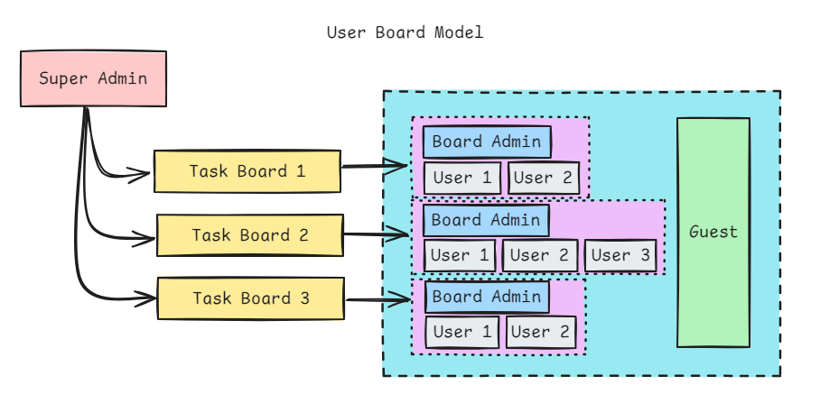

# TaskIt-Backend
A POC for a multi tenant task manager.

This POC demonstrates:
1. User authentication
2. Role based Hierarchy & Authorization
3. JWT token authentication
4. Path based authentication
5. Namespace based authentication

## Architectural Design
### User Board Diagram

### User Roles

